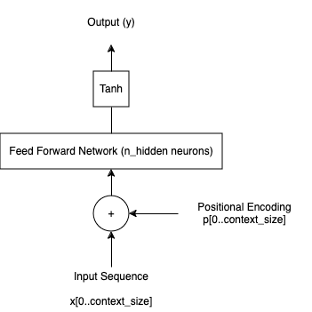

# positional-embedding-expt
A based feed-forward network that demonstrates trainable positional encodings. The model is trained and tested with random dataset.

## Setup

### Requirements
The required packages can be found in `requirements.txt` file. The python version used is `Python 3.10.6`. Run the following commands to setup the repository to train and test the code.
```
$ python -m venv <env>
$ source <env>/bin/activate
$ pip install -r requirements.txt
```

### Model
The following is the flow of whole model.



Every datapoint is of size `context_size`, and they are added with trainable `positional_encoding`, which is of same size. The input is fed into a 1 layer neural network that predicts just one output. The output is activated with Tanh and the output is calculated.

`model.py` file has the architecture of the model.

### Training and Testing the Model

`main.py` file has the basic code to run and test the model. The first few lines have some parameters that need to be defined to run the model.
- `context_size` determines the size of the context of the model which will need positional encoding.
- `n_hidden` represents the number of neurons in the feed forward network.
- `xlen` indicates the number of elements in the dummy data set created.
- `num_epochs` decides the number of iterations the model needs to run.

The program prints the initialized `positional_encodings` in the beginning before training, and after training to get the update encodings. 

**Inferences**
- The loss hardly reduces as the dataset is basically random. There is nothing for the model to learn.
- The positional encodings change after every iteration. Although the values do not represent anything understandable now, it does prove that they can be trainable.

## Question

### Suppose that we design a deep architecture to represent a sequence by stacking self-attention layers with positional encoding. What could be issues?

- With an increase in self-attention layers, the basic issue would be a rapid increase in the number of parameters. This basically indicates longer training times and higher computational resources. 

- Deeper Neural Networks generally have a tendency to overfit the data and hence potentially fail on unseen test data.

- There could be a issue of vanishing/exploding gradient during back propogation. This makes training ineffective.

- Finally, in attention we have a non-linearity aspect with a Softmax application before looking at values. However, if that is bypassed, regardless of the number of self-attention layers, in the end it just narrows down to one Q, K, V paramter matrices. Basically, everything becomes linear. Hence regardless of number of self-attention layers, they end up acting like just one.